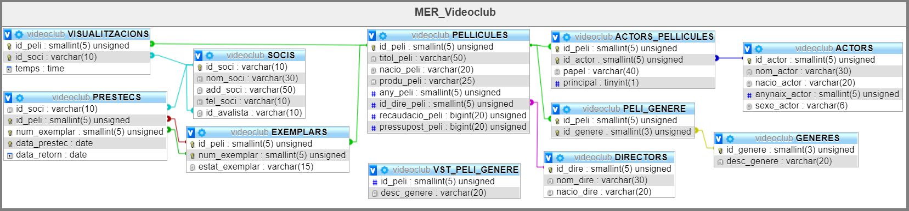

# Activitat 1: Usuaris i privilegis en MySQL.

[MP02_UF03_Act_01_UsuPri_MySQL.pdf](./documents/MP02_UF03_Act_01_UsuPri_MySQL.pdf)

**1.** Crea un usuari nou amb el teu **`cognomnom`** en el servidor local.

...

Consta de 13 apartats

...

Creeu un fitxer sql amb el resultat de cada apartat. Per exemple, el nom del fitxer que
conté la solució a l'apartat 1 serà:

**`CognomNom_Act_01_UsuPri_MySQL_Apartat_001.sql`**
I el lliurament, serà un fitxer comprimit (`zip`, o `rar`) que contindrà tots els fitxers sql de
cadascun dels apartats.

**`CognomNom_Act_01_UsuPri_MySQL.zip`**

Recordeu que la correcció la faré pujant el fitxer que m'enviïs i executant-lo directament
al meu servidor. Per tant, sabreu si em funcionarà o no, si executant-lo vosaltres en el
vostre servidor funciona o no.

# Activitat 2: Treballadors amb fills.
# Activitat 3: Activitats de procediments emmagatzemats 
# Activitat 4: Activitats de SP amb cursors

# Enunciats per practicar amb els `INSERT`'s

**1.** Emprant la base de dades **`videoclub`**, cal que:
Insertis, com a mínim **tres** registres, a **totes** i cadascuna de les **taules** que existeixen a la base de dades de **`videoclub`**.

~~~~sql
+---------------------+
| Taules a videoclub  |
+---------------------+
| ACTORS              |
| ACTORS_PELLICULES   |
| DIRECTORS           |
| EXEMPLARS           |
| PELLICULES          |
| PRESTECS            |
| SOCIS               |
+---------------------+
~~~~
La informació de cada pel·lícula cal que la obtingeu de la web [IMDb.com](https://www.imdb.com/). 
